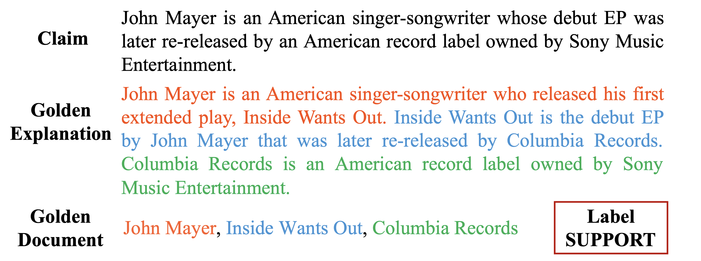

# EX-FEVER
A Dataset for Multi-hop Explainable Fact Verification



## 0. Preparation 

First, install [drqa](https://github.com/facebookresearch/DrQA/tree/main#installing-drqa)

```sh
git clone https://github.com/facebookresearch/DrQA.git
cd DrQA; pip install -r requirements.txt; python setup.py develop
```

```sh
pip install -r requirements
```

## 1. Document Retrieval

We first use [TF-IDF retrieval](https://github.com/facebookresearch/DrQA/tree/main/scripts/retriever) to yield the top-200 relevant Wikipedia documents.

```python
python scripts/build_tfidf.py data/wiki_wo_links.db results
```

```python
python scripts/exfc_tfidf.py results/wiki_db-tfidf-ngram=2-hash=16777216-tokenizer=simple.npz results
```

Add tfidf rank and score to train/dev/test and save it to an additional csv file

Then the neural-based Document Retrieval Model. Implement by [HOVER](https://github.com/hover-nlp/hover)

```python
python scripts/prepare_data_for_fcdoc_retrieval.py --data_split=dev --doc_retrieve_range=200
python scripts/prepare_data_for_doc_retrieval.py --data_split=train --doc_retrieve_range=200
```

Training the neural-based document retrieval model

```sh
./scripts/train_doc_retrieval.sh
```

And a multi-hop design retrieval model [Multi-Hop Dense Text Retrieval (`MDR`)](https://github.com/facebookresearch/multihop_dense_retrieval#p-aligncentermulti-hop-dense-text-retrieval-mdrp)

## 2. Explanatory stage

We fine tune a bart model through [transformer library][https://github.com/huggingface/transformers/tree/main/examples/pytorch/text-generation]

## 3. Verdict prediction

We use a bert model and GEAR model respectively

Finetune a bert model through [transformer library](https://github.com/huggingface/transformers/tree/main/examples/pytorch/text-classification)

Train the Gear model through https://github.com/thunlp/GEAR

## 4. Prompt base

This section will use the mini test dataset and request the OpenAI API to utilize the GPT-3.5 Turbo model for claim verification.

You should add your openai API key by modifying the code:  `openai.api_key = 'your_api_key'`

```sh
python scripts/openai_api.py claim_only
```

You can choose the prompt temples from 'w_exp', 'claim_only', 'wo_exp', 'w_exp_doc1', 'w_exp_doc3', 'json'

The test results are saved to the results fold.

## 5. Data characteristic


