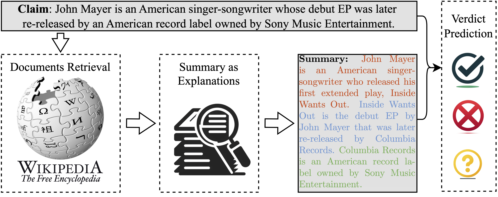
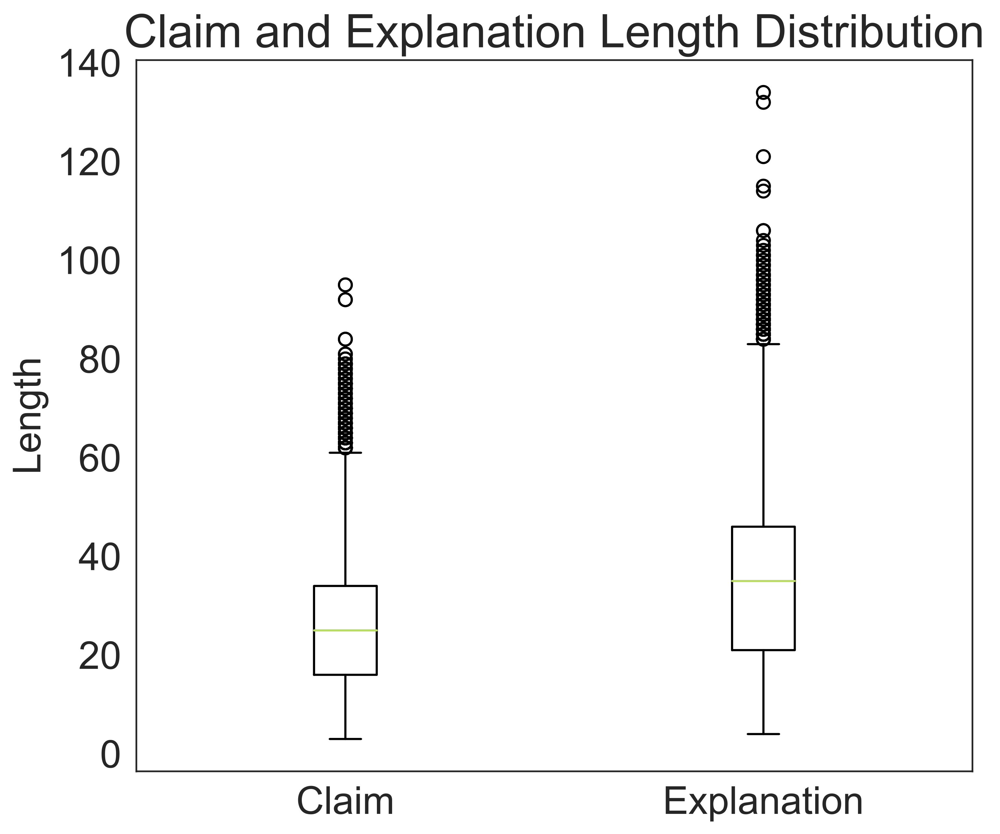
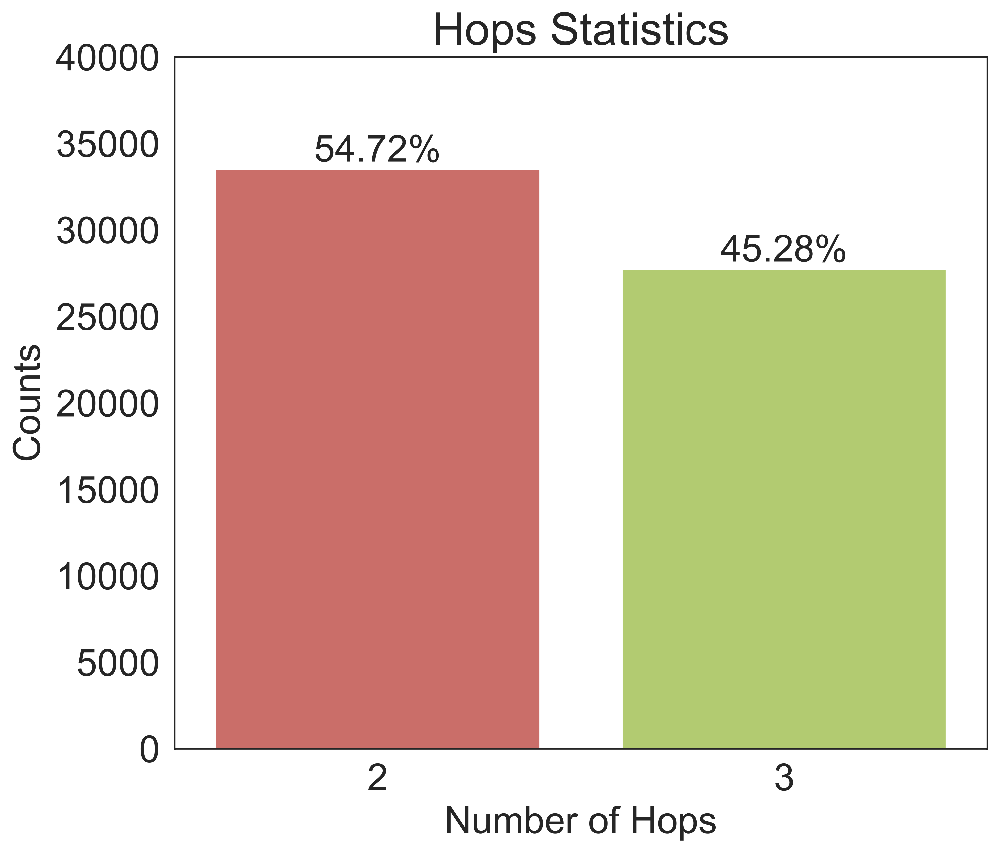

# EX-FEVER
A Dataset for Multi-hop Explainable Fact Verification
ACL 2024 (Findings)


A sample in the proposed dataset EX-FEVER. The textual explanation in different colors refers to the information in different documents.



The baseline system comprises three stages: document retrieval, summary generation as explanations, and verdict prediction. The system produces two main outputs: a veracity label indicating whether the claim is 'SUPPORT'ed, 'REFUTE'd, or there is 'NOT ENOUGH INFO', and a summary that serves as an explanation for the prediction.

## 0. Preparation 

First, install [drqa](https://github.com/facebookresearch/DrQA/tree/main#installing-drqa)

```sh
git clone https://github.com/facebookresearch/DrQA.git
cd DrQA; pip install -r requirements.txt; python setup.py develop
```

```sh
pip install -r requirements
```

## 1. Document Retrieval

We first use [TF-IDF retrieval](https://github.com/facebookresearch/DrQA/tree/main/scripts/retriever) to yield the top-200 relevant Wikipedia documents.

```python
python scripts/build_tfidf.py data/wiki_wo_links.db results
```

```python
python scripts/exfc_tfidf.py results/wiki_db-tfidf-ngram=2-hash=16777216-tokenizer=simple.npz results
```

Add tfidf rank and score to train/dev/test and save it to an additional csv file

Then the neural-based Document Retrieval Model. Implement by [HOVER](https://github.com/hover-nlp/hover)

```python
python scripts/prepare_data_for_fcdoc_retrieval.py --data_split=dev --doc_retrieve_range=200
python scripts/prepare_data_for_doc_retrieval.py --data_split=train --doc_retrieve_range=200
```

Training the neural-based document retrieval model

```sh
./scripts/train_doc_retrieval.sh
```

And a multi-hop design retrieval model [Multi-Hop Dense Text Retrieval (`MDR`)](https://github.com/facebookresearch/multihop_dense_retrieval#p-aligncentermulti-hop-dense-text-retrieval-mdrp)

## 2. Explanatory stage

We fine tune a bart model through [transformer library](https://github.com/huggingface/transformers/tree/main/examples/pytorch/text-generation)

## 3. Verdict prediction

We use a bert model and GEAR model respectively

Finetune a bert model through [transformer library](https://github.com/huggingface/transformers/tree/main/examples/pytorch/text-classification)

Train the Gear model through https://github.com/thunlp/GEAR

## 4. Using LLMs in Fact-Checking

In this section, we conduct preliminary investigations into using Large Language Models (LLMs) for fact-checking in two ways: 

1. Directly using LLMs as an actor.
2. Using LLMs as a planner.

We evaluate both the verdict accuracy and the ability of LLMs to generate explanations.

### Methodology

We will use a mini test dataset and the OpenAI API to utilize the GPT-3.5 Turbo model for claim verification. To do this, you need to add your OpenAI API key by modifying the following code:

```python
openai.api_key = 'your_api_key'
```

Run the script using the command:

```sh
python scripts/openai_api.py claim_only
```

### Prompt Templates

You can choose from the following prompt templates:

- `w_exp`
- `claim_only`
- `wo_exp`
- `w_exp_doc1`
- `w_exp_doc3`
- `json`

### Results

The test results are saved to the `results` folder.

### LLM as a Planner

We use LLMs as a planner through [ProgramFC](https://github.com/teacherpeterpan/ProgramFC).

## 5. Data characteristic



| Hops   | SUP   | REF   | NEI   | Claim | EXP   |
|--------|-------|-------|-------|-------|-------|
| 2 Hops | 11053 | 11059 | 11412 | 21.63 | 28.39 |
| 3 Hops | 9337  | 9463  | 8941  | 30.69 | 43.45 |
| Total  | 20390 | 20522 | 20353 | 25.73 | 35.21 |

---

## Citation
If you use this dataset, please cite the following paper:

```bibtex
@article{ma2023exfever,
  title={Ex-fever: A dataset for multi-hop explainable fact verification},
  author={Ma, Huanhuan and Xu, Weizhi and Wei, Yifan and Chen, Liuji and Wang, Liang and Liu, Qiang and Wu, Shu},
  journal={arXiv preprint arXiv:2310.09754},
  year={2023}
}
```
